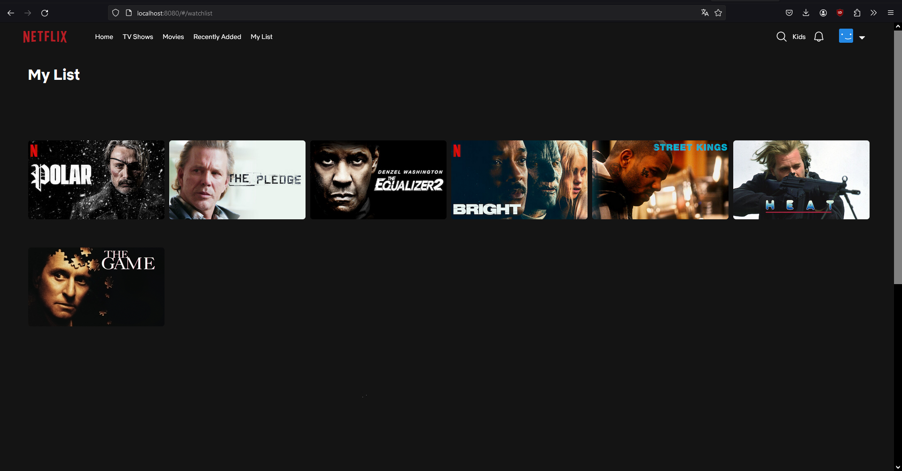
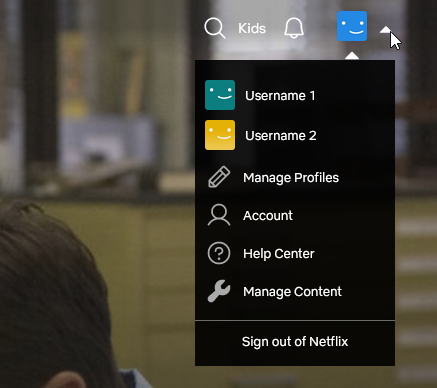

# netflix-style-web-app
The web application is a clone of Netflix, one of the most popular video-on-demand (VOD) services. Netflix has a sophisticated yet highly intuitive user interface, which inspired me to delve into web development.

**Tech stack used**:
  - MongoDB
  - Express.js
  - React
  - Node.js
  - Firebase

**Features**:

**User panel**:
  - **Browsing thematic lists of movies and series**: Users have the ability to explore various thematic lists, such as 'Critically Acclaimed' or 'Horrors'.
  - **Filtering thematic lists by genre**: After applying filters, only lists containing movies and series of a specific genre will be displayed.
  - **Rating content**: Users are able to rate selected movies and series using a star rating system, where one star represents the lowest rating and five stars the highest.
  - **Adding and removing a movie or series from the favorites list**
  - **Browsing a short video snippet**: Upon hovering over the thumbnail of the selected content, users have the option to view a brief video snippet, allowing them to familiarize themselves with the content of the film before making a decision.
  - **Detailed information about the content**: Users can check detailed information about selected movies and series, such as the full cast, director, year of production, genre, and duration.
  - **Browsing an expandable list of seasons and episodes of TV series**: After selecting a specific season or episode, users have access to information about individual episodes and their descriptions.
  - **Navigating to the video content**: After selecting the thumbnail of a particular piece of content, users will be able to directly go to the playback page, where they can watch the full version of the movie or series. The progress of              viewing the content is saved in the database, and this information is visible to the user in the form of a progress bar under the selected episode of a TV series or movie.
  - **Searching for content by title, creator's name and genre.**

**Administrator panel**:
  - **Displaying existing movies, series and lists**: The administrator can browse and view existing movies, series, and thematic lists.
  - **Adding, editing and deleting movies, series and lists**: The administrator can add new movies, series and create thematic lists. They can also edit and delete existing items.

**What I'm currently working on**:
  - Responsiveness of the application
  - Improving code quality
  - Implementing a content recommendation engine in Python
  - Soon I'll deploy the app:)

# Screenshots
**Filtering thematic lists by genre**:

**Browsing a short video snippet**:

**Detailed information about the content**:

**Browsing an expandable list of seasons and episodes of TV series**:

**Searching for content**

**Watchlist**

**Menu**

